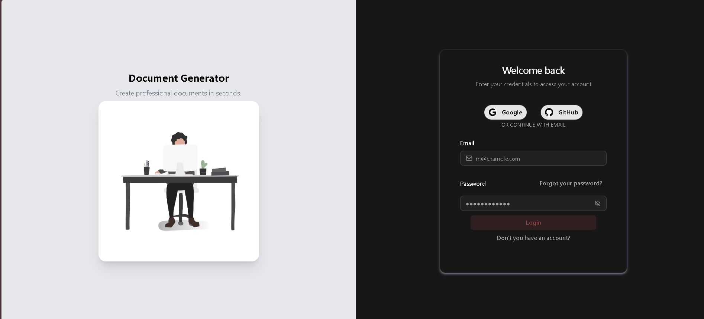
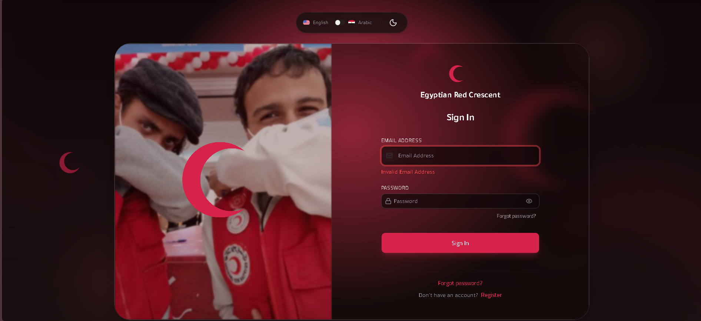
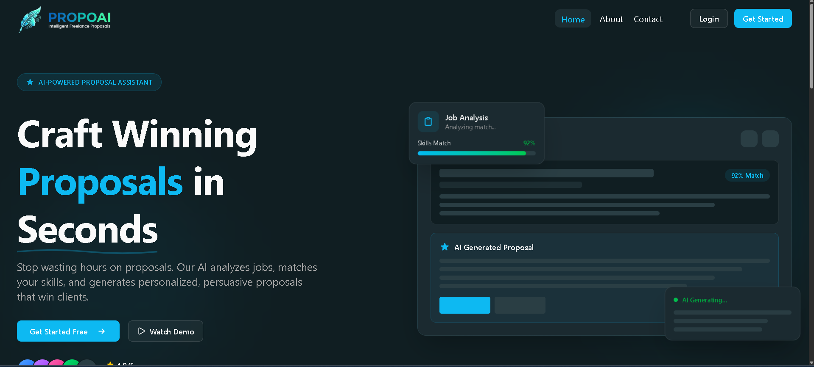
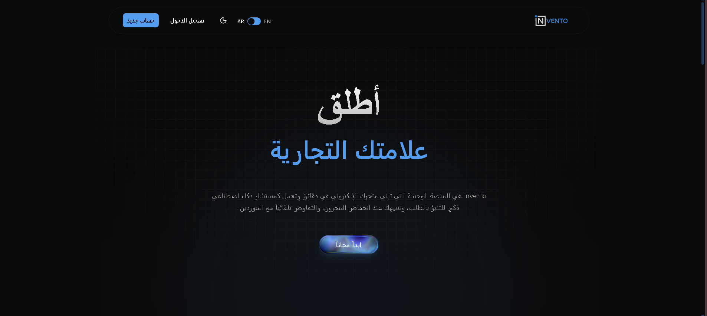

**Mo'men Mamdouh** — Full-Stack Software Engineer based in Egypt 🇪🇬

I build production web applications end to end: Angular and React on the front, Node, NestJS and
Express behind them, with AI woven in where it removes real manual work rather than as decoration.
Currently focused on AI-assisted document and proposal tooling.

## 🚀 &nbsp;Featured Projects

<!-- PROJECTS:START -->

<table>
  <tr>
    <td width="50%" valign="top">

<b>Document Generator</b>

Turns unstructured input into finished, professionally formatted documents using AI and predefined templates.

🔒 Private repository

Angular · Express · MongoDB · OpenAI · Gemini · TypeScript

</td>
    <td width="50%" valign="top">

<b>Egyptian Red Crescent — Operations Dashboard</b>

Dashboard for coordinating daily field missions, built for the Egyptian Red Crescent.

🔒 Private repository

React · TypeScript · Redux Toolkit · TanStack Query · Tailwind · shadcn/ui

</td>
  </tr>
  <tr>
    <td width="50%" valign="top">

<b>AI Proposal Assistant</b>

Generates client proposals from your CV, GitHub activity and portfolio, with a community layer for sharing them.

🔒 Private repository

Angular · TypeScript · Tailwind

</td>
    <td width="50%" valign="top">

<b>Portfolio CMS</b>

Headless content system for developer portfolios and CVs. pnpm + Turborepo monorepo, Dockerised, tested with Vitest.

🔒 Private repository

TypeScript · Turborepo · pnpm · Docker · Vitest

</td>
  </tr>
  <tr>
    <td width="50%" valign="top">

<a href="https://github.com/mohamedtaghian/Invento-AI"><b>Invento AI</b></a>

Inventory platform with server-side rendering. Built together with @mohamedtaghian.

<b>Collaboration</b>

Angular · Express · SSR · Tailwind · TypeScript

</td>
    <td width="50%" valign="top">

</td>
  </tr>
</table>

<!-- PROJECTS:END -->

## 🧰 &nbsp;Tech Stack

  <!-- Frontend & UI -->
  
<b>Frontend & UI</b>

  <picture>
    <source media="(prefers-color-scheme: dark)"
      srcset="https://skillicons.dev/icons?i=angular,react,nextjs,vue,nuxtjs,ts,js,html,css,sass,tailwind,bootstrap,materialui&theme=dark&perline=7" />
    
  </picture>

    

  <!-- Backend, State & Databases -->
  
<b>Backend, State & Databases</b>

  <picture>
    <source media="(prefers-color-scheme: dark)"
      srcset="https://skillicons.dev/icons?i=nodejs,nestjs,express,fastapi,go,redux,pinia,redis,mongodb,postgres,mysql&theme=dark&perline=6" />
    
  </picture>

    

  <!-- DevOps, Testing & Tooling -->
  
<b>DevOps, Testing & Tooling</b>

  <picture>
    <source media="(prefers-color-scheme: dark)"
      srcset="https://skillicons.dev/icons?i=vite,docker,git,github,githubactions,pnpm,npm,postman,vitest&theme=dark&perline=9" />
    
  </picture>

 

&nbsp;<b>Explore Full Toolkit & Ecosystem</b>

 

| Domain | Technologies & Libraries |
| :--- | :--- |
| **Frontend & UI** | Angular · React · Next.js · Vue.js · Nuxt.js · TypeScript · JavaScript · HTML5 · CSS3 · Sass · PostCSS · Tailwind CSS · Bootstrap · [Spartan UI](https://spartan.ng) · [shadcn/ui](https://ui.shadcn.com) · [Material UI (MUI)](https://mui.com) · Vite · Storybook · Lucide Icons |
| **State Management & Data** | Redux Toolkit · Zustand · Pinia · TanStack Query (React Query) · Axios · Formik · React Hook Form · Zod · Yup |
| **Backend & Architecture** | Node.js · NestJS · Express.js · FastAPI (Python) · Go (Golang) · RESTful APIs · WebSockets (Socket.io) · Clean Architecture · Modular Monoliths · Microservices |
| **Databases & Caching** | MongoDB · PostgreSQL · MySQL · Redis · Supabase · Firebase · Mongoose · Prisma · TypeORM |
| **Testing & Quality** | Vitest · Jest · React Testing Library · ESLint · Prettier · Husky |
| **DevOps, Monorepos & Cloud** | Docker · Docker Compose · GitHub Actions · CI/CD · Vercel · Render · Railway · AWS (S3 basics) · Nginx · Turborepo · pnpm · npm · Git · GitHub · Postman · Linux / Bash |
| **AI & Modern Integrations** | OpenAI API · Google Gemini API · LangChain · Vercel AI SDK |
| **Other Languages** | C · C++ · Python · Photoshop |

## 📊 &nbsp;GitHub Analytics

<picture>
  <source media="(prefers-color-scheme: dark)"
    srcset="https://github-readme-stats-eight-theta.vercel.app/api?username=Momen-Mamdouh&show_icons=true&hide_border=true&include_all_commits=true&count_private=true&bg_color=0D1117&title_color=22EBF7&text_color=C9D1D9&icon_color=22EBF7" />
  
</picture>
<picture>
  <source media="(prefers-color-scheme: dark)"
    srcset="https://github-readme-stats-eight-theta.vercel.app/api/top-langs/?username=Momen-Mamdouh&layout=compact&langs_count=8&hide_border=true&bg_color=0D1117&title_color=22EBF7&text_color=C9D1D9" />
  
</picture>

<picture>
  <source media="(prefers-color-scheme: dark)"
    srcset="https://streak-stats.demolab.com?user=Momen-Mamdouh&hide_border=true&background=0D1117&ring=22EBF7&fire=22EBF7&currStreakLabel=22EBF7&stroke=21262D&sideLabels=C9D1D9&dates=8B949E&sideNums=C9D1D9&currStreakNum=E6EDF3" />
  
</picture>

## 🐍 &nbsp;Contribution Snake

  

    
    
  

  <picture>
    <source media="(prefers-color-scheme: dark)"
      srcset="https://raw.githubusercontent.com/Momen-Mamdouh/Momen-Mamdouh/output/github-contribution-grid-snake-dark.svg" />
    <source media="(prefers-color-scheme: light)"
      srcset="https://raw.githubusercontent.com/Momen-Mamdouh/Momen-Mamdouh/output/github-contribution-grid-snake.svg" />
    
  </picture>

   
  <i>Interactive contribution tracker — animated eating real-time commits across repositories</i>

## 📫 &nbsp;Connect

